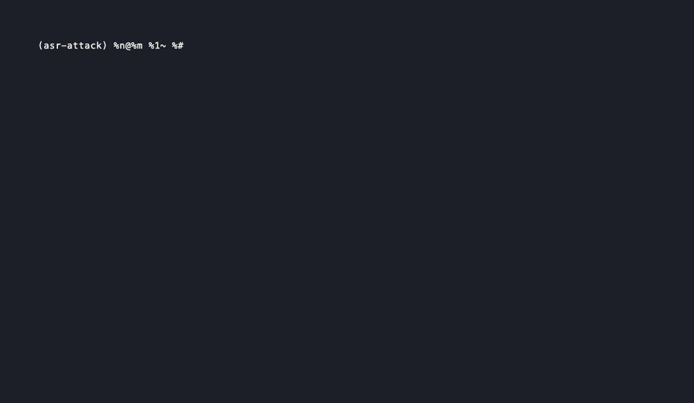

<h1 align="center">asr-attack</h1>

<p align="center">
  <a href="https://pypi.org/project/asr-attack/"></a>
  <a href="https://www.python.org/downloads/"></a>
  <a href="LICENSE"></a>
</p>

<p align="center">
  <i>Adversarial robustness toolkit for Hugging Face ASR — Whisper, wav2vec2, MMS, HuBERT, ... — with FGSM, PGD, noise, and environmental attacks in one consistent API.</i>
</p>

---

## Demo



<sub>Rendered with <a href="https://github.com/charmbracelet/vhs">VHS</a>. Reproduce with <code>vhs docs/demo.tape</code>.</sub>

## Why this exists

The computer-vision community has [Foolbox](https://github.com/bethgelab/foolbox) and [Adversarial Robustness Toolbox](https://github.com/Trusted-AI/adversarial-robustness-toolbox): clean, model-agnostic libraries that turn "attack my model" into a one-liner. **Speech recognition does not have an equivalent.** If you want to know whether your fine-tuned wav2vec2 survives 10 dB of background babble, or whether Whisper holds up under FGSM at ε=0.02, you currently glue together model-specific code from papers, fight HuggingFace feature extractors, and write your own WER pipeline.

`asr-attack` is the missing piece: one `Attack.fgsm()` / `Attack.pgd()` / `Attack.noise()` / `Attack.environment()` API that works on any HF ASR model, plus a `run_benchmark` that takes `(model_id, attack, dataset, n_samples)` and gives you back a `Report` with text / JSON / self-contained HTML output.

## Quick start

```python
from asr_attack import Attack, run_benchmark

report = run_benchmark(
    model="openai/whisper-tiny",
    attack=Attack.fgsm(epsilon=0.02),
    dataset="hf-internal-testing/librispeech_asr_dummy",
    n_samples=10, split="validation", config="clean",
)
print(report.summary())
report.to_html("report.html")    # self-contained HTML with embedded charts
```

Three complete runnable scripts live in [`examples/`](examples/), one per
attack family and model architecture:

| Script | Model | Attack | Family |
|---|---|---|---|
| [`whisper_tiny_fgsm.py`](examples/whisper_tiny_fgsm.py) | `openai/whisper-tiny` | FGSM, ε=0.02 | white-box, seq2seq |
| [`wav2vec2_pgd.py`](examples/wav2vec2_pgd.py) | `facebook/wav2vec2-base-960h` | PGD, ε=0.02, 10 steps | white-box, CTC |
| [`hubert_noise.py`](examples/hubert_noise.py) | `facebook/hubert-large-ls960-ft` | Gaussian noise, SNR=10 dB | black-box, CTC |

Each script prints a summary and writes a self-contained HTML report plus a
JSON dump next to itself. Run any of them with
`uv run python examples/<script>.py`.

Install:

```bash
uv add asr-attack       # or: pip install asr-attack
```

## Supported models

White-box attacks (FGSM, PGD) need a differentiable path from the waveform to the loss. The wrapper exposes `model.supports_waveform_gradient`, which gates these attacks. Black-box attacks (noise, environment) work on **every** row of the table.

| Model family | Transcribe | White-box (FGSM / PGD) | Notes |
|---|:---:|:---:|---|
| wav2vec2 / wav2vec2-conformer | ✓ | ✓ | reference CTC path |
| HuBERT, WavLM, UniSpeech(-SAT), SEW(-D), data2vec-audio | ✓ | ✓ | same wav2vec2 interface |
| MMS | ✓ | ✓ | wav2vec2 + per-language adapters (`language=` kwarg) |
| Whisper (tiny / base / small / medium / large / large-v2 / large-v3) | ✓ | ✓ | torch-side log-mel; `language=` kwarg |
| M-CTC-T | ✓ | ✗ | mel-spec input, no torch extractor yet |
| SpeechT5, S2T (non-Whisper seq2seq) | ✓ | ✗ | no torch extractor yet |

### Multilingual

For Whisper and MMS, pass `language=` to switch under the hood:

```python
HFASRModel.from_pretrained("openai/whisper-large-v3", language="it")   # ISO 639-1 or name
HFASRModel.from_pretrained("facebook/mms-1b-fl102",   language="ita")  # ISO 639-3
```

Same kwarg, two very different mechanisms:

- **Whisper** consumes `language` as a runtime prompt token. The wrapper threads it into `generate(language=..., task="transcribe")` for inference and into `processor.get_decoder_prompt_ids(language=...)` when building the labels for FGSM/PGD. Use ISO 639-1 codes (`"en"`, `"it"`, `"fr"`) or full names (`"english"`).
- **MMS** loads the corresponding per-language LM head + attention adapter at construction time (`target_lang=...` + `ignore_mismatched_sizes=True`). Use ISO 639-3 codes (`"eng"`, `"ita"`, `"fra"`).
- Single-language models (wav2vec2-base-960h, hubert-large-ls960-ft, ...) accept the kwarg for API symmetry but ignore it.

## Supported attacks

**`Attack.fgsm(epsilon)`** — Fast Gradient Sign Method ([Goodfellow et al. 2014](https://arxiv.org/abs/1412.6572)). Single-step gradient ascent in the L∞ ball of radius `epsilon`: `x_adv = clip(x + ε · sign(∇L), -1, 1)`. Cheap and fast, surprisingly effective even at imperceptible budgets. On a typical clean LibriSpeech sample it pushes wav2vec2-base from WER 0 to ~0.06 at ε=0.02, with the perturbation sitting ~10 dB below the signal.

**`Attack.pgd(epsilon, alpha, n_steps, random_start)`** — Projected Gradient Descent ([Madry et al. 2017](https://arxiv.org/abs/1706.06083)). FGSM iterated for `n_steps` with step `alpha`, projecting back into the L∞ ball after each step, with optional uniform-noise random start. **Substantially stronger than FGSM at the same budget**: same ε=0.02, wav2vec2 WER goes from 0.06 (FGSM) to ~0.82 (PGD 10-step), and the perturbation is actually *quieter* (~14 dB SNR) because the iterative refinement places energy more selectively.

**`Attack.noise(snr_db, kind)`** — Mix i.i.d. Gaussian or uniform white noise at a target signal-to-noise ratio. Black-box: no gradient, no model required, works on any ASR. The classic baseline for "is my model robust to background noise?" — Gaussian at SNR 10 dB ≈ noisy office, at SNR 0 dB ≈ inside a loud bar.

**`Attack.environment(ir_path, background_path, snr_db)`** — MUSAN-style environmental degradation. Convolves with an impulse response (room reverb, recorded or synthetic) and/or mixes in a background recording at a target SNR. The background can be stationary noise (traffic, AC), music, or another speaker — the last case triggers the classic *cocktail-party failure* where the ASR transcribes the background instead of the target. Compatible with [MUSAN](https://www.openslr.org/17/) out of the box.

## Example output

Run [`examples/whisper_tiny_fgsm.py`](examples/whisper_tiny_fgsm.py) to get a
self-contained HTML report ([`examples/whisper_tiny_fgsm.html`](examples/whisper_tiny_fgsm.html))
and a JSON dump ([`examples/whisper_tiny_fgsm.json`](examples/whisper_tiny_fgsm.json))
of 10 LibriSpeech-dummy validation samples attacked at ε=0.02:

```text
$ uv run python examples/whisper_tiny_fgsm.py
asr-attack benchmark report
===========================
Model        : openai/whisper-tiny
Attack       : fgsm
Dataset      : hf-internal-testing/librispeech_asr_dummy
Samples      : 10

Clean WER    : 0.106
Adv   WER    : 0.528
WER delta    : +0.421
Mean SNR     : 10.7 dB
```

A single forward-backward pass per sample lifts WER from 10.6% to 52.8% while
the perturbation stays ~10 dB below the signal. For comparison,
`wav2vec2_pgd.py` (PGD, 10 steps, same ε=0.02) drives WER from 5.5% to 61.0%
on `wav2vec2-base-960h`, and `hubert_noise.py` (Gaussian noise at 10 dB SNR)
nudges `hubert-large-ls960-ft` from 3.5% to 5.5% — large models stay robust
to mild noise, but white-box gradient attacks devastate both.

## Roadmap

- **[Carlini-Wagner attack](https://arxiv.org/abs/1801.01944)** (L₂ / L∞): optimization-based, finds minimum-perturbation adversarials. Slower than PGD but tighter — useful for "audibility-bounded" attack research.
- **Psychoacoustic masking** ([Schönherr et al. 2018](https://arxiv.org/abs/1808.05665)): shape adversarial noise so it falls under the human hearing threshold given the speech masker — perceptually inaudible attacks against ASR.
- **Torch-side feature extractors for non-Whisper seq2seq** (SpeechT5, S2T) and M-CTC-T → unlocks FGSM/PGD on those families too.
- **Audio-domain transforms** as black-box attacks: MP3 transcoding round-trip, telephony band-pass (300-3400 Hz), packet loss simulation — common real-world degradations that aren't reverb or additive noise.
- **PGD adversarial training**: defensive side of the coin — use these attacks during fine-tuning to harden ASR models.

## Development

```bash
uv sync --group dev
uv run pytest -m "not slow"     # fast unit tests
uv run pytest                   # full suite (downloads ~500 MB of models + a tiny LibriSpeech sample)
```

## License

MIT — see [LICENSE](LICENSE).

## Contributing

Issues and PRs welcome. To add a new attack, subclass `Attack` (see [`asr_attack/attacks/base.py`](asr_attack/attacks/base.py)) and register a classmethod factory there. White-box attacks should gate on `model.supports_waveform_gradient`; black-box attacks accept `model=None` and run on any input. New attacks are expected to come with both a unit test and an end-to-end "WER goes up" slow test against `facebook/wav2vec2-base-960h` on the LibriSpeech dummy sample (see [`tests/test_pgd.py`](tests/test_pgd.py) for the canonical shape).
